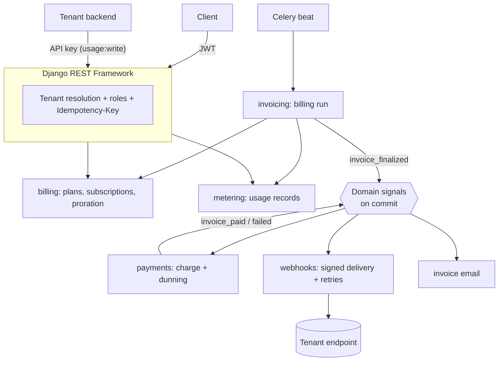

# Tenantly

[](https://github.com/ebrahimmorkas/tenantly/actions/workflows/ci.yml)


**Tenantly** is a **multi-tenant subscription billing API**, the kind of backend that sits
behind a SaaS product's pricing page. It handles organizations and roles, plans and
subscriptions, mid-cycle upgrades with proration, metered usage, invoicing, card payments with
dunning, and signed webhooks.

Billing systems are unforgiving: double-charging, lost usage or a skipped invoice number are
real bugs with real consequences. This project focuses on getting those details right.

---

## Highlights

| Area | What's implemented |
| --- | --- |
| **Multi-tenancy** | Organizations as tenants, owner > admin > billing > member roles, tenant resolved before permission checks, 404 (not 403) for other tenants |
| **API keys** | `tk_live_…` keys, SHA-256 hashed at rest, constant-time comparison, scopes, expiry, revocation, per-key rate limits |
| **Subscriptions** | Trials, upgrades with **exact integer-cent proration**, downgrades scheduled for period end, cancel/resume, anchored billing periods (Jan 31 → Feb 28 → Mar 31) |
| **Metering** | Usage events with per-tenant idempotency keys, overage billed per started block |
| **Invoicing** | **Gapless per-tenant invoice numbers**, fee in advance + usage in arrears, credit carry-forward, idempotent billing run that catches up missed periods |
| **Payments** | Pluggable gateway (Stripe-like fake by default), auto-charge, **dunning** (retry 1/3/5 days → past_due → canceled), gateway idempotency keys |
| **Webhooks** | HMAC-SHA256 signatures with replay protection, exponential retries, delivery log, **SSRF protection** |
| **Idempotency** | `Idempotency-Key` header on every tenant-scoped write (replay, 409 in-flight, 422 on reuse) |
| **Quality** | 134 tests, 95% coverage, PostgreSQL concurrency tests, CI on SQLite *and* PostgreSQL + Redis |

## Architecture



Apps talk to each other through **domain signals sent after commit**: invoicing doesn't know
about payments, and payments doesn't know about webhooks. Each app can be tested on its own.

```
apps/
├── accounts/       # users + JWT
├── organizations/  # tenants, memberships, roles, tenancy mixin
├── apikeys/        # hashed keys, authentication, scopes, throttling
├── billing/        # plans, subscriptions, proration, InvoiceItem ledger, money helpers
├── metering/       # usage records, overage calculation
├── invoicing/      # invoices, numbering, billing run, upcoming invoice
├── payments/       # gateway abstraction, payment methods, dunning
├── webhooks/       # endpoints, events, signed deliveries, SSRF guard
└── core/           # health, error envelope, Idempotency-Key support, seed_demo
```

## Redis is optional

| Variable | Set | Not set |
| --- | --- | --- |
| `DATABASE_URL` | PostgreSQL (real row locks) | SQLite |
| `REDIS_URL` | Redis cache (shared rate limits) + Celery broker | Local-memory cache, Celery tasks run eagerly |

Without Celery beat, run the billing cycle from cron with `python manage.py run_billing`.
CI runs the full suite in both configurations.

## Getting started

```bash
python -m venv .venv && source .venv/bin/activate   # Windows: .venv\Scripts\activate
pip install -r requirements-dev.txt
cp .env.example .env
python manage.py migrate
python manage.py seed_demo      # prints a demo login and a one-time API key
python manage.py runserver
```

Interactive docs: <http://localhost:8000/api/docs/>

Or the full stack (PostgreSQL, Redis, worker, beat):

```bash
docker compose up --build
docker compose exec web python manage.py seed_demo
```

## API walkthrough

```bash
API=http://localhost:8000/api/v1
TOKEN=$(curl -s -X POST $API/auth/token/ -H 'Content-Type: application/json' \
  -d '{"email":"owner@acme.dev","password":"demo-pass-123"}' | jq -r .access)
AUTH="Authorization: Bearer $TOKEN"

# Preview, then apply, an upgrade (prorated)
curl -s "$API/orgs/acme/subscription/preview-change/?plan=scale" -H "$AUTH"
curl -s -X POST $API/orgs/acme/subscription/change-plan/ -H "$AUTH" \
  -H 'Content-Type: application/json' -H 'Idempotency-Key: upgrade-42' -d '{"plan":"scale"}'

# Report usage from your backend with an API key (safe to retry)
curl -s -X POST $API/orgs/acme/usage/ -H "X-API-Key: $API_KEY" \
  -H 'Content-Type: application/json' -d '{"quantity": 250, "idempotency_key": "req-8f3a"}'

# What will the next invoice look like?
curl -s $API/orgs/acme/invoices/upcoming/ -H "$AUTH"
```

| Endpoint | Purpose |
| --- | --- |
| `POST /auth/register/`, `/auth/token/` | Account + JWT |
| `GET/POST /orgs/` · `/orgs/{org}/members/` | Tenants and memberships |
| `/orgs/{org}/api-keys/` | Create (plaintext shown once) / revoke keys |
| `GET /plans/` | Public catalog |
| `/orgs/{org}/subscription/` + `preview-change/`, `change-plan/`, `cancel/`, `resume/` | Subscription lifecycle |
| `/orgs/{org}/usage/` + `summary/` | Metered usage |
| `/orgs/{org}/invoices/` + `upcoming/` | Invoices |
| `/orgs/{org}/payment-method/`, `/payments/`, `/payments/pay/{number}/` | Cards, payment attempts, manual retry |
| `/orgs/{org}/webhooks/` + `test/`, `rotate-secret/`, `deliveries/` | Webhooks |

### Verifying webhooks (consumer side)

```python
from apps.webhooks.signing import verify  # or copy this 20-line function

def handle(request):
    if not verify(ENDPOINT_SECRET, request.body, request.headers["Tenantly-Signature"]):
        return HttpResponse(status=400)
```

## Design decisions

**Integer cents, one rounding.** Every amount is an integer number of cents. Proration is
computed with `Decimal` and rounded half-up exactly once, so a credit and a charge for the same
period always add up.

**Periods computed from an anchor.** Naively adding "one month" to the previous period end
drifts (Jan 31 → Feb 28 → Mar 28 …). Tenantly always computes `anchor + n months`.

**Exactly-once billing.** The billing run locks each subscription, bills the ended period and
moves the period forward in one transaction, so running it twice or concurrently is harmless.
Invoice numbers come from a row-locked per-tenant sequence, which keeps them gapless (an
accounting requirement that a global auto-increment can't guarantee). Both properties are
tested with real threads on PostgreSQL.

**Retries are always safe.** Usage events carry an idempotency key, every write endpoint
honours `Idempotency-Key`, payment attempts send `<invoice>-<attempt>` to the gateway, and
webhook deliveries are rows with explicit attempts. A timeout followed by a retry never
double-counts, double-bills or double-charges.

**Tenant isolation by construction.** Tenant-scoped views resolve the organization once and
build every queryset through `self.scope()`. API keys are bound to a single organization, and
callers from other tenants get a 404.

**PostgreSQL in CI matters.** SQLite ignores `SELECT … FOR UPDATE`. The PostgreSQL job caught
a lock that joined a nullable relation, which Postgres rejects. It's fixed with
`select_for_update(of=("self",))`.

## Testing

```bash
pytest                                                    # SQLite, no Redis
DATABASE_URL=postgres://... REDIS_URL=redis://... pytest  # + concurrency tests
ruff check . && ruff format --check .
```

## License

MIT
